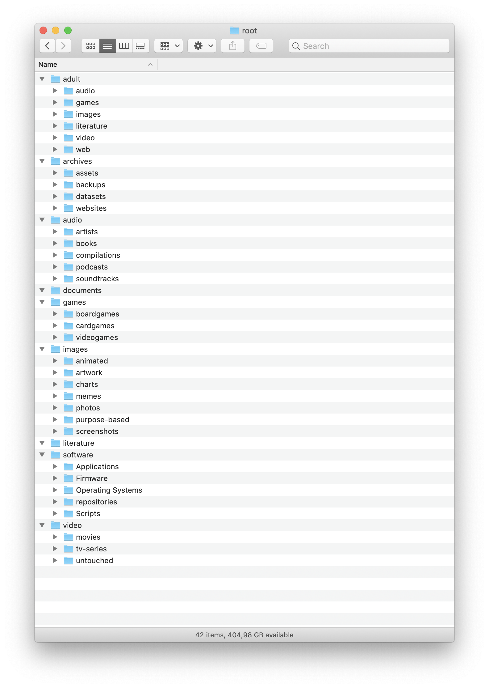

# filetree

Hello and welcome to the [r/datacurator](https://reddit.com/r/datacurator) filetree repository.

We aim to create a unified filetree for all kinds of data, which should help in storing, categorising and retrieving.

## Branches

You are now looking at the default full-blown filetree. Often times you don't need that. So we have a few other variants that you can use, which may better fit your use-case.

[default](https://github.com/roboyoshi/datacurator-filetree/tree/master) - The "master" filetree that includes everything.

[plex](https://github.com/roboyoshi/datacurator-filetree/tree/chroot/plex) - Only contains the folder structures relevant to the Plex Media Server

[scene](https://github.com/roboyoshi/datacurator-filetree/tree/chroot/scene) - A filetree that is suited for curating warez

[home](https://github.com/roboyoshi/datacurator-filetree/tree/user/roboyoshi.home) - A view on my personal folder structure for user accounts.

> Note: If you think we are missing a (common) scenario, feel free to open an issue and request it.
>
> We will try to review and incorporate it here.

## Overview

Here is a quick screenshot on what the current tree looks like (occasionally updated).

## Contributing

If you are interested in joining our efforts, please read the [CONTRIBUTING.md](CONTRIBUTING.md).
